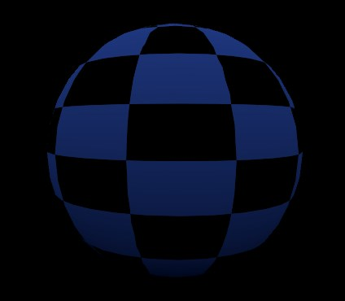

# Checker Pattern
###  [Unity Introduction to Shader Graph](https://learn.unity.com/tutorial/introduction-to-shader-graph#5f500900edbc2a0022843fb6)

First and foremost the introduction to shader graph guide is quite straight forward. However the pitfalls come from the fact that it was last updated using Unity 2019 meaning it is quite outdated now. 

Creation of shader graph is straight forward right click > select shader graph.

<b>Helpfull tip regarding panning: Use Alt + Left Mouse click to pan around shader graph! Doh! </b>

The guide shows how to transform a simple jpg image into something that can wrap around a material such as the ball.

### Nodes Used:
- Simple Texture Asset: Importing the Jpg image base
- Sample Texture 2D: Converts the Asset texture into a mappable texture
- Divide: Input a texture and outputs that texture divided, this has the function of "Reducing darkness"
- Blend: This can take two inputs and transform them into a single output. Blend(4) the 4 means it takes RGBA.
- Tiling and Offset: This node can transform the tiling of the Sameple texture 2D and goes into the UV(2) input

### Changes from Unity 2019 now in 2023
- Primarly the output is no longer a Unlit Master node but a Fragment. Update settings from Graph Inspector > Graph Settings > Universal > Surface Type = Transparent
- Output from Sample Texture 2D is no longer A(1) intead use any of RGB outputs

 
MD
7-Nov-2023 