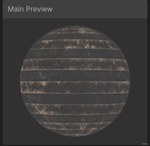

# ShaderGraph
Learning Shader Graph
 
[2-TimeVertex](./2-VertexTime/) a simple time dependant shader  

[1-CheckerPattern](./1-CheckerPattern/)
A simple checker pattern following [Intro to Shader Graph - Unity](https://learn.unity.com/tutorial/introduction-to-shader-graph#)
